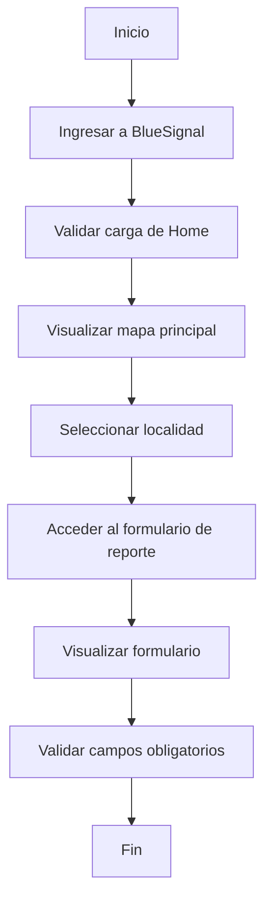

# Entrega 1 — Análisis del Caso de Negocio

## 1. Selección del sitio de pruebas

### Sitio seleccionado

https://bluesignal.org

### Descripción general

BlueSignal es una plataforma web orientada al registro colaborativo de avistajes de fauna marina. El sistema permite que los usuarios ingresen desde un navegador web, visualicen información relacionada con observaciones marinas y accedan a un formulario para reportar nuevos avistajes.

### Flujo funcional

```text
Ingreso a la web → Visualización de home/mapa → Selección de localidad → Acceso a Reportar → Validación del formulario
```

### Consideraciones de testing

Para esta primera etapa se priorizan pruebas seguras sobre producción, evitando la creación real de avistajes para no contaminar información productiva, métricas del sistema o posibles notificaciones a usuarios reales.

---

# 2. Análisis del flujo principal del sistema

## Flujo principal identificado

```text
Inicio
↓
Ingreso a bluesignal.org
↓
Carga de Home principal
↓
Visualización del mapa interactivo
↓
Selección de localidad
↓
Acceso al formulario de reporte
↓
Visualización del formulario
↓
Validación de campos obligatorios
↓
Fin del flujo
```

## Diagrama de flujo



---

# 3. Páginas identificadas

## Página 1 — Home

### URL

```text
https://bluesignal.org
```

### Objetivo funcional

Permitir al usuario visualizar información principal del sistema, acceder al mapa y navegar hacia el flujo de reporte.

### Elementos relevantes

* Título principal
* Mapa interactivo
* Selector de localidad
* Botón “Reportar”
* Navbar principal

---

## Página 2 — Formulario de reporte

### URL esperada

```text
/reportar/
```

### Objetivo funcional

Permitir al usuario iniciar el proceso de carga de un avistaje.

### Elementos relevantes

* Campos del formulario
* Selector de especie
* Selector de ubicación/localidad
* Campo comentario
* Botón enviar
* Mensajes de validación

---

# 4. Elementos clave identificados

## Home

| Elemento              | Objetivo                                     |
| --------------------- | -------------------------------------------- |
| Título de la página   | Validar carga correcta                       |
| Mapa principal        | Validar renderizado del componente principal |
| Botón Reportar        | Validar navegación al formulario             |
| Selector de localidad | Validar interacción de contexto geográfico   |

---

## Formulario de reporte

| Elemento              | Objetivo                             |
| --------------------- | ------------------------------------ |
| Campos obligatorios   | Validar reglas del formulario        |
| Botón enviar          | Validar interacción principal        |
| Mensajes de error     | Validar validaciones frontend        |
| Inputs del formulario | Validar disponibilidad y visibilidad |

---

# 5. Casos de prueba propuestos

## CP01 — Validar acceso inicial a BlueSignal

### Objetivo

Verificar que el usuario pueda ingresar correctamente a la plataforma.

### Validaciones

* La web responde correctamente
* El título de la página contiene “BlueSignal”
* La home carga correctamente

---

## CP02 — Validar visualización de home y mapa

### Objetivo

Verificar que el mapa principal de BlueSignal se visualice correctamente.

### Validaciones

* El contenedor principal del mapa está visible
* El componente de mapa carga correctamente
* La interfaz principal se renderiza correctamente

---

## CP03 — Validar selección de localidad

### Objetivo

Verificar que el usuario pueda seleccionar correctamente una localidad.

### Validaciones

* El selector de localidad está disponible
* El usuario puede seleccionar “Mar del Plata”
* El sistema actualiza correctamente la localidad seleccionada
* La URL refleja el contexto de localidad seleccionado

---

## CP04 — Validar acceso al formulario de reporte

### Objetivo

Verificar que el usuario pueda acceder correctamente al formulario de reporte.

### Validaciones

* El usuario puede acceder al flujo de reporte
* El botón “Reportar” funciona correctamente
* La navegación hacia `/reportar/` se realiza correctamente
* El formulario de reporte se carga correctamente


---

## CP05 — Validar reglas básicas del formulario

### Objetivo

Verificar que el formulario no permita enviar reportes incompletos.

### Validaciones

* El formulario de reporte carga correctamente
* El botón “Reportar avistaje” permanece deshabilitado cuando el formulario está vacío
* El sistema impide el envío de reportes incompletos

---

# 6. Estrategia de automatización

## Estrategia inicial

Se decidió comenzar con pruebas funcionales básicas y seguras sobre producción, evitando operaciones que generen datos reales dentro del sistema.

Las pruebas iniciales se enfocan en:

* navegación
* validaciones frontend
* accesibilidad de componentes
* renderizado de interfaz
* disponibilidad funcional básica

## Consideraciones

No se automatizará el envío real de avistajes durante esta etapa para evitar:

* contaminación de métricas
* generación de datos falsos
* posibles notificaciones reales
* alteración de información productiva

---

# 7. Tecnologías utilizadas

## Stack utilizado

* Java 17
* Maven
* Selenium WebDriver
* JUnit 5
* WebDriverManager

## Arquitectura inicial implementada

El framework fue estructurado utilizando separación de responsabilidades:

```text
tests/
→ casos de prueba

core/
→ configuración base y manejo de drivers

pages/
→ futuras páginas Page Object Model

utils/
→ utilidades reutilizables
```

## Configuración implementada

Se implementaron dos modos de ejecución del WebDriver:

### Modo automático

Uso de WebDriverManager para descarga y configuración automática del driver.

### Modo manual/local

Uso de ChromeDriver local almacenado dentro del proyecto para escenarios corporativos o ambientes sin acceso externo.

### Manejo de estado inicial del navegador

Durante las pruebas automatizadas se identificó una interferencia causada por el flujo de instalación PWA (Progressive Web App) del sitio.

El sistema dispara un prompt nativo de instalación luego de ciertas interacciones del usuario, lo que afectaba la estabilidad de las pruebas automatizadas al interceptar clicks funcionales.

Para resolverlo sin modificar producción, se implementó una preparación automática del estado del navegador utilizando `localStorage`, simulando un usuario que previamente rechazó la instalación de la aplicación.

Esto permitió estabilizar los flujos automatizados manteniendo independencia entre pruebas y evitando alterar el comportamiento productivo del sistema.

---

# 8. Automatización inicial implementada

## Casos automatizados implementados

### CP01 — Validar acceso inicial a BlueSignal

- validación de carga inicial
- validación de título de página

### CP02 — Validar visualización de mapa principal

- validación de renderizado del mapa principal

### CP03 — Validar selección de localidad

- selección automatizada de localidad
- validación de actualización de contexto geográfico

### CP04 — Validar acceso al formulario de reporte

- navegación automatizada hacia el formulario de reporte
- validación de acceso funcional al flujo de reporte

### CP05 — Validar restricciones iniciales del formulario

- validación de bloqueo del envío de formularios incompletos
